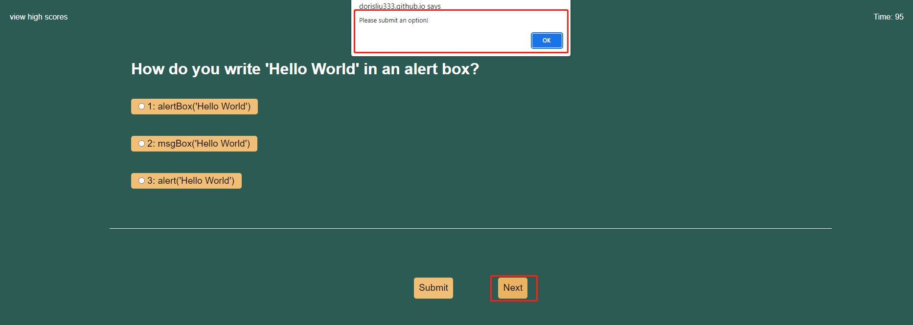

## Coding Assessment

* This project is built a typical coding assessment that combine of multiple-choice questions and interactive coding challenges. This app will run in the browser, and will feature dynamically updated HTML and CSS powered by JavaScript code. 

* When user open the API, will show the description of the code assessment, and in the middle is the start button, when press the start button the page will turn to the quiz page and the timer will start to count. If you click the "view high score", will turn to the high score page.

* For the quiz page, user will see multiple-choice questions, if you find the correct answer, click on the left circle of the answer, then press the submit button

* if your answer is correct, will show "Correct!", and if the answer is incorrect will show "Incorrect!" and the time will be penalized 10 seconds.

* If you press submit without select any answer, it will alert that need to select the answer first.

* If you press next without submit an answer, it will alert that need to submit first.

* Once you submit an answer, the radio will be unable to chose again.

* When user finish the assessment or run out of the time, will turn to the Done page, use can see the score and will need to submit initials.

* If user submit empty, will alert that need to submit initials

* After user submit the initials, will turn to the High Score page, and will show the initials and score, and the score will be sorted from high to low.

  
* If user click clear score button, the score record will be clear, if no click clear button, the score record will still show when you open the score pag, if click go back button will turn to the start page

  

## Deployed URL:
 https://dorisliu333.github.io/code-assessment-chujunliu/